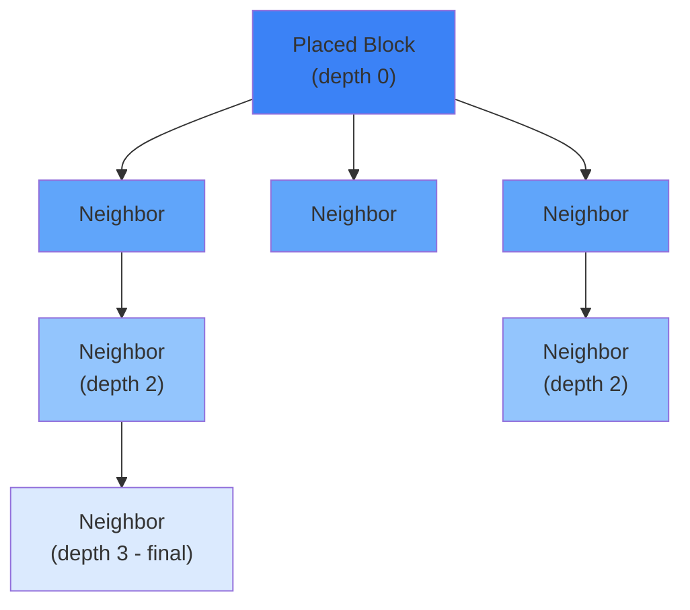

# Image TODO List

This file tracks ASCII art that should be replaced with actual screenshots, plus additional screenshot opportunities for the documentation.

## Image Hosting Strategy

For Cloudflare Pages, you have three options:

### Option 1: Direct in Repository (Recommended for <50MB total)
Place images in `docs/public/images/` - they deploy automatically with your site.
- **Pros**: Simple, version controlled, automatic CDN caching
- **Cons**: Increases repo size, not ideal for many large images

### Option 2: Cloudflare R2 (Recommended for larger image sets)
Use R2 object storage for images, reference via custom domain or R2 public URL.
- **Pros**: Cheap storage, scales well, same Cloudflare edge network
- **Cons**: Separate management, requires R2 bucket setup
- **Docs**: https://developers.cloudflare.com/pages/tutorials/use-r2-as-static-asset-storage-for-pages/

### Option 3: Cloudflare Images (Best for dynamic resizing)
Dedicated image hosting with automatic optimization and variants.
- **Pros**: Auto-resize, optimization, transformations
- **Cons**: Additional cost per image served
- **Docs**: https://developers.cloudflare.com/images/

**Recommendation**: Start with Option 1 (in-repo). If images exceed ~50MB total, migrate to R2.

---

## Priority 1: ASCII Art Replacements

These ASCII diagrams represent in-game visuals and should be replaced with actual screenshots.

### 1. Stair Block Connection Diagram

**File**: `src/content/docs/plugin-development/world/connected-blocks.mdx`
**Lines**: 21-26

**Current ASCII**:
```
Regular Stair    +    Adjacent Stair    =    Corner Variant
    ___                   ___                   ___
   |   |                 |   |                 |   |___
   |___|                 |___|                 |___|   |
```

**Screenshot Needed**: Side-by-side comparison showing:
1. A single stair block (straight variant)
2. Two stair blocks placed adjacent
3. The resulting corner piece that forms automatically

**Suggested filename**: `images/blocks/stair-connection-example.png`

**Replacement code**:
```mdx

```

---

### 2. Update Cascade Propagation

**File**: `src/content/docs/plugin-development/world/connected-blocks.mdx`
**Lines**: 308-322

**Current ASCII**:
```
Update Cascade (depth 3):

    Placed Block (depth 0)
         │
    ┌────┼────┐
    │    │    │
Neighbor Neighbor Neighbor (depth 1)
...
```

**Screenshot Needed**: Debug visualization or diagram showing:
- A block being placed (highlighted)
- Neighbor blocks that update (depth 1, different color)
- Secondary neighbors (depth 2, lighter color)
- Final cascade (depth 3, lightest)

**Suggested filename**: `images/blocks/update-cascade-depth.png`

**Note**: This may work better as a Mermaid diagram since it's showing a system concept rather than in-game visuals. Consider converting to:



---

### 3. Light Propagation Distance

**File**: `src/content/docs/plugin-development/world/lighting.mdx`
**Lines**: 331-343

**Current ASCII**:
```
Propagation from center block:

          Corner (-3)
         /
     Edge (-2)
    /
Side (-1) ─ CENTER ─ Side (-1)
...
```

**Screenshot Needed**: Top-down or isometric view showing:
- A glowing block in the center
- Light values displayed on neighboring blocks
- Color gradient showing light falloff (sides brighter, corners dimmer)

**Suggested filename**: `images/world/light-propagation-pattern.png`

**Replacement code**:
```mdx

```

---

## Priority 2: High-Value Screenshots

These pages would significantly benefit from screenshots.

### Blockbench Setup Tutorial

**File**: `src/content/docs/tutorials/blockbench/setup.mdx`

| Screenshot | Description | Filename |
|------------|-------------|----------|
| [ ] | Blockbench main window with "Hytale Model" option visible | `images/tutorials/blockbench/main-window.png` |
| [ ] | File > Plugins menu showing search/install flow | `images/tutorials/blockbench/plugin-install.png` |
| [ ] | Settings panel with Grid, Preview, Keybindings highlighted | `images/tutorials/blockbench/settings-panel.png` |
| [ ] | Outliner panel showing node count | `images/tutorials/blockbench/outliner-panel.png` |
| [ ] | Export dialog for .blockymodel | `images/tutorials/blockbench/export-dialog.png` |

### Custom Weapon Tutorial

**File**: `src/content/docs/tutorials/examples/custom-weapon.mdx`

| Screenshot | Description | Filename |
|------------|-------------|----------|
| [ ] | Flame Sword 3D render from Blockbench | `images/tutorials/examples/flame-sword-model.png` |
| [ ] | Texture editor with gradient application | `images/tutorials/examples/texture-editor.png` |
| [ ] | In-game weapon held in player hand | `images/tutorials/examples/weapon-ingame.png` |
| [ ] | Particle effects during attack | `images/tutorials/examples/attack-particles.png` |
| [ ] | Crafting recipe in weapon bench UI | `images/tutorials/examples/crafting-recipe.png` |

### Block Types Reference

**File**: `src/content/docs/asset-development/blocks/block-types.mdx`

| Screenshot | Description | Filename |
|------------|-------------|----------|
| [ ] | DrawType comparison: Cube vs Model vs CubeWithModel vs Empty | `images/blocks/types/drawtype-comparison.png` |
| [ ] | Ore block showing rock cube with model overlay | `images/blocks/types/ore-overlay.png` |
| [ ] | Stairs showing different state variants | `images/blocks/types/stair-variants.png` |
| [ ] | Door open/close states | `images/blocks/types/door-states.png` |

### Particle Systems

**File**: `src/content/docs/asset-development/vfx/particles.mdx`

| Screenshot | Description | Filename |
|------------|-------------|----------|
| [ ] | Combat impact particles | `images/vfx/particles/combat-impact.png` |
| [ ] | Weather rain/snow particles | `images/vfx/particles/weather-effects.png` |
| [ ] | Block break particles | `images/vfx/particles/block-break.png` |
| [ ] | Status effect particles | `images/vfx/particles/status-effects.png` |

---

## Priority 3: Medium-Value Screenshots

### NPC Models

**File**: `src/content/docs/asset-development/npcs/models.mdx`

| Screenshot | Description | Filename |
|------------|-------------|----------|
| [ ] | Fox, Bear, Human models showing scale differences | `images/npcs/models/scale-comparison.png` |
| [ ] | Hitbox visualization overlay | `images/npcs/models/hitbox-overlay.png` |
| [ ] | Animation states (Idle, Walk, Run, Jump) | `images/npcs/models/animation-states.png` |

### Environments

**File**: `src/content/docs/asset-development/world/environments.mdx`

| Screenshot | Description | Filename |
|------------|-------------|----------|
| [ ] | Zone comparisons (Plains, Desert, Taiga, Volcanic) | `images/world/environments/zone-comparison.png` |
| [ ] | Time-of-day progression | `images/world/environments/time-of-day.png` |
| [ ] | Weather transitions | `images/world/environments/weather-transition.png` |

### Weapons Reference

**File**: `src/content/docs/asset-development/items/weapons.mdx`

| Screenshot | Description | Filename |
|------------|-------------|----------|
| [ ] | One example of each weapon category | `images/items/weapons/weapon-categories.png` |
| [ ] | Bow charging progression | `images/items/weapons/bow-charging.png` |

---

## Priority 4: Lower-Value Screenshots

### Hitboxes

**File**: `src/content/docs/plugin-development/physics/hitboxes.mdx`

| Screenshot | Description | Filename |
|------------|-------------|----------|
| [ ] | Entity with hitbox wireframe overlay | `images/npcs/models/hitbox-wireframe.png` |
| [ ] | Detail boxes (head, body, limbs) colored | `images/npcs/models/detail-boxes.png` |
| [ ] | Block hitbox shapes | `images/blocks/types/block-hitboxes.png` |

### Interaction Lifecycle

**File**: `src/content/docs/plugin-development/interactions/interaction-lifecycle.mdx`

| Screenshot | Description | Filename |
|------------|-------------|----------|
| [ ] | Charging UI with progress indicator | `images/ui/charging-progress.png` |

---

## Directory Structure

Ensure these directories exist (already created):

```
docs/public/images/
├── tutorials/
│   ├── blockbench/
│   └── examples/
├── items/
│   ├── weapons/
│   ├── tools/
│   ├── armor/
│   └── consumables/
├── blocks/
│   └── types/
├── npcs/
│   ├── models/
│   └── behaviors/
├── vfx/
│   ├── particles/
│   └── trails/
├── world/
│   ├── environments/
│   └── weather/
└── ui/
```

---

## Image Guidelines

1. **Format**: PNG for screenshots, WebP for photos if size is a concern
2. **Dimensions**:
   - Full-width: 1200px wide max
   - Inline: 600-800px wide
   - Icons/small: 200-400px wide
3. **File size**: Keep under 500KB per image, ideally under 200KB
4. **Naming**: Use kebab-case, descriptive names
5. **Alt text**: Always include descriptive alt text for accessibility

---

## Completion Tracking

- [ ] Priority 1: ASCII Art Replacements (3 images)
- [ ] Priority 2: High-Value Screenshots (~20 images)
- [ ] Priority 3: Medium-Value Screenshots (~10 images)
- [ ] Priority 4: Lower-Value Screenshots (~5 images)

**Total estimated images**: ~38
