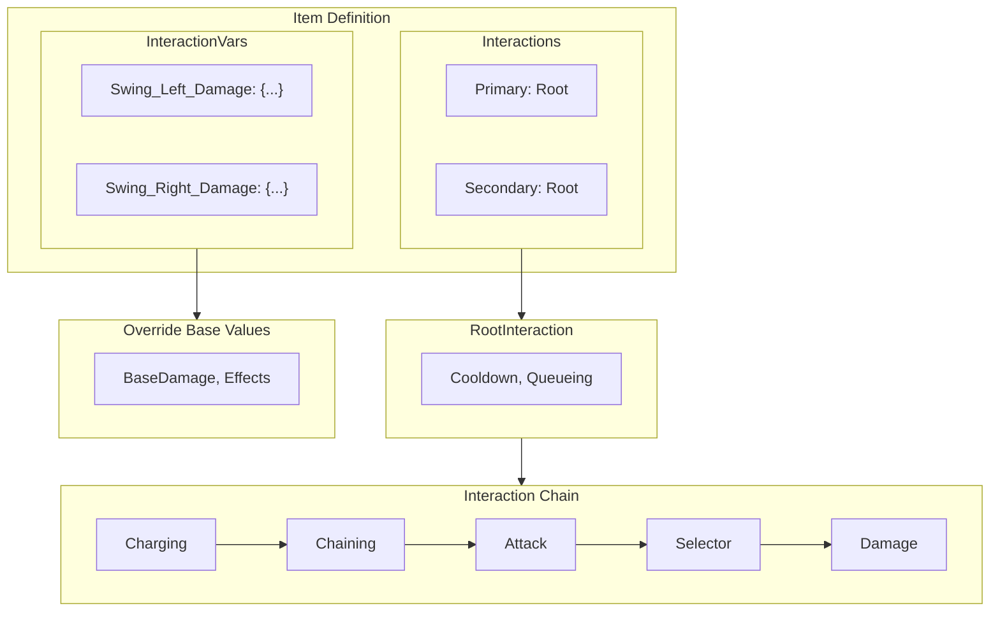

{/* [VERIFIED: 2026-01-20] */}

import { Aside, Tabs, TabItem, FileTree } from '@astrojs/starlight/components';

The combat system defines weapon attacks, damage calculations, and effects through a layered interaction architecture. Items override base interactions using `InteractionVars` to customize damage, effects, and behavior.

## System Architecture



## Asset Locations

<FileTree>
- Assets/Server/Item/
  - Items/Weapon/
    - Sword/
      - Template_Weapon_Sword.json
      - Weapon_Sword_Iron.json
    - Mace/
    - Dagger/
    - Battleaxe/
  - RootInteractions/
    - Weapons/
      - Sword/
        - Root_Weapon_Sword_Primary.json
        - Root_Weapon_Sword_Secondary_Guard.json
        - Root_Weapon_Sword_Signature_Vortexstrike.json
  - Interactions/
    - Weapons/
      - Sword/
        - Attacks/
          - Primary/
          - Secondary/
          - Signature/
</FileTree>

## Item Interactions

Items define interaction bindings in the `Interactions` property:

```json title="Template_Weapon_Sword.json (excerpt)"
{
  "Interactions": {
    "Primary": "Root_Weapon_Sword_Primary",
    "Secondary": "Root_Weapon_Sword_Secondary_Guard",
    "Ability1": "Root_Weapon_Sword_Signature_Vortexstrike"
  }
}
```

| Binding | Description |
|---------|-------------|
| `Primary` | Left-click / primary attack |
| `Secondary` | Right-click / secondary action |
| `Ability1` | Special/signature ability |
| `Ability2` | Additional ability |

## Root Interactions

Root interactions define the entry point for attack chains:

```json title="Root_Weapon_Sword_Primary.json"
{
  "RequireNewClick": true,
  "ClickQueuingTimeout": 0.2,
  "Cooldown": {
    "Cooldown": 0.25
  },
  "Interactions": [
    "Weapon_Sword_Primary"
  ]
}
```

| Field | Type | Description |
|-------|------|-------------|
| `RequireNewClick` | `bool` | Require new input for each attack |
| `ClickQueuingTimeout` | `float` | Input queue window (seconds) |
| `Cooldown` | `object` | Cooldown configuration |
| `Cooldown.Cooldown` | `float` | Cooldown duration (seconds) |
| `Interactions` | `array` | Interaction chain to execute |

## Interaction Types

### Charging

Hold-to-charge mechanics with time-based thresholds:

```json title="Weapon_Sword_Primary.json"
{
  "Type": "Charging",
  "DisplayProgress": false,
  "Next": {
    "0": "Weapon_Sword_Primary_Chain",
    "0.2": {
      "Type": "Replace",
      "Var": "Thrust_Stamina",
      "DefaultOk": true,
      "DefaultValue": {
        "Interactions": [
          "Weapon_Sword_Primary_Thrust_StaminaCondition"
        ]
      }
    }
  }
}
```

| Field | Type | Description |
|-------|------|-------------|
| `Type` | `"Charging"` | Charging interaction type |
| `DisplayProgress` | `bool` | Show charge bar |
| `Next` | `object` | Time-based branches (keys are seconds) |

### Chaining

Combo attack sequences:

```json title="Weapon_Sword_Primary_Chain.json"
{
  "Type": "Chaining",
  "ChainingAllowance": 2,
  "ChainId": "Sword_Swings",
  "Next": [
    {
      "Type": "Replace",
      "DefaultOk": true,
      "Var": "Swing_Left",
      "DefaultValue": {
        "Interactions": [
          "Weapon_Sword_Primary_Swing_Left"
        ]
      }
    },
    {
      "Type": "Replace",
      "DefaultOk": true,
      "Var": "Swing_Right",
      "DefaultValue": {
        "Interactions": [
          "Weapon_Sword_Primary_Swing_Right"
        ]
      }
    },
    {
      "Type": "Replace",
      "DefaultOk": true,
      "Var": "Swing_Down",
      "DefaultValue": {
        "Interactions": [
          "Weapon_Sword_Primary_Swing_Down"
        ]
      }
    }
  ]
}
```

| Field | Type | Description |
|-------|------|-------------|
| `Type` | `"Chaining"` | Chaining interaction type |
| `ChainingAllowance` | `int` | Max combo chain count |
| `ChainId` | `string` | Unique chain identifier |
| `Next` | `array` | Sequential attack options |

### Simple

Basic single-action interactions:

```json title="Weapon_Sword_Primary_Swing_Left.json"
{
  "Type": "Simple",
  "RunTime": 0.117,
  "Effects": {
    "ItemAnimationId": "SwingLeft",
    "WorldSoundEventId": "SFX_Light_Melee_T2_Swing",
    "LocalSoundEventId": "SFX_Sword_T2_Swing_RL_Local"
  },
  "Next": {
    "Type": "Replace",
    "Var": "Swing_Left_Selector",
    "DefaultOk": true,
    "DefaultValue": {
      "Interactions": [
        "Weapon_Sword_Primary_Swing_Left_Selector"
      ]
    }
  }
}
```

| Field | Type | Description |
|-------|------|-------------|
| `Type` | `"Simple"` | Simple interaction type |
| `RunTime` | `float` | Execution time (seconds) |
| `Effects` | `object` | Visual/audio effects |
| `Next` | `object` | Next interaction in chain |

## Damage Interactions

Damage interactions define damage calculations and hit effects:

```json title="Weapon_Sword_Primary_Swing_Left_Damage.json"
{
  "Parent": "DamageEntityParent",
  "DamageCalculator": {
    "Class": "Light"
  },
  "Effects": {
    "CameraEffect": "Impact"
  },
  "DamageEffects": {
    "Knockback": {
      "Type": "Force",
      "VelocityConfig": {
        "AirResistance": 0.99,
        "AirResistanceMax": 0.98,
        "GroundResistance": 0.94,
        "GroundResistanceMax": 0.3,
        "Threshold": 3.0,
        "Style": "Linear"
      },
      "Direction": {
        "X": 0,
        "Y": 1,
        "Z": -1
      },
      "Force": 6.0,
      "VelocityType": "Add"
    },
    "WorldParticles": [
      {
        "SystemId": "Impact_Sword_Basic"
      }
    ],
    "CameraEffect": "Impact_Light"
  },
  "EntityStatsOnHit": [
    {
      "EntityStatId": "SignatureEnergy",
      "Amount": 1
    }
  ]
}
```

### DamageCalculator

| Field | Type | Description |
|-------|------|-------------|
| `Class` | `string` | Damage class (Light, Normal, Heavy) |
| `BaseDamage` | `object` | Damage by type |
| `BaseDamage.Physical` | `float` | Physical damage amount |
| `Type` | `string` | Calculation type (`Absolute`) |
| `RandomPercentageModifier` | `float` | Damage variance (0.1 = ±10%) |

### DamageEffects

| Field | Type | Description |
|-------|------|-------------|
| `Knockback` | `object` | Knockback configuration |
| `WorldParticles` | `array` | Particles spawned on hit |
| `WorldSoundEventId` | `string` | Sound played globally |
| `LocalSoundEventId` | `string` | Sound played locally |
| `CameraEffect` | `string` | Camera shake on hit |

### Knockback Configuration

| Field | Type | Description |
|-------|------|-------------|
| `Type` | `string` | Knockback type (`Force`) |
| `Direction` | `object` | Knockback direction `{X, Y, Z}` |
| `Force` | `float` | Knockback strength |
| `VelocityType` | `string` | How velocity is applied (`Add`) |
| `VelocityConfig` | `object` | Physics configuration |

### EntityStatsOnHit

Stats modified when attack hits:

```json
"EntityStatsOnHit": [
  {
    "EntityStatId": "SignatureEnergy",
    "Amount": 1
  }
]
```

## InteractionVars

Items override base interactions using `InteractionVars`. This allows items to customize damage while sharing the same attack animations:

```json title="Weapon_Sword_Iron.json (InteractionVars)"
{
  "InteractionVars": {
    "Swing_Left_Damage": {
      "Interactions": [
        {
          "Parent": "Weapon_Sword_Primary_Swing_Left_Damage",
          "DamageCalculator": {
            "BaseDamage": {
              "Physical": 9
            }
          },
          "DamageEffects": {
            "WorldSoundEventId": "SFX_Sword_T2_Impact",
            "LocalSoundEventId": "SFX_Sword_T2_Impact"
          }
        }
      ]
    },
    "Swing_Right_Damage": {
      "Interactions": [
        {
          "Parent": "Weapon_Sword_Primary_Swing_Right_Damage",
          "DamageCalculator": {
            "BaseDamage": {
              "Physical": 10
            }
          }
        }
      ]
    },
    "Swing_Down_Damage": {
      "Interactions": [
        {
          "Parent": "Weapon_Sword_Primary_Swing_Down_Damage",
          "DamageCalculator": {
            "BaseDamage": {
              "Physical": 18
            }
          }
        }
      ]
    },
    "Thrust_Damage": {
      "Interactions": [
        {
          "Parent": "Weapon_Sword_Primary_Thrust_Damage",
          "DamageCalculator": {
            "BaseDamage": {
              "Physical": 26
            }
          },
          "EntityStatsOnHit": [
            {
              "EntityStatId": "SignatureEnergy",
              "Amount": 3
            }
          ]
        }
      ]
    }
  }
}
```

### Var Names

Common InteractionVar names for weapons:

| Var Name | Description |
|----------|-------------|
| `Swing_Left_Damage` | Left swing damage |
| `Swing_Right_Damage` | Right swing damage |
| `Swing_Down_Damage` | Overhead swing damage |
| `Thrust_Damage` | Charged thrust damage |
| `Guard_Wield` | Guard/block stance |
| `Vortexstrike_Spin_Damage` | Signature spin damage |
| `Vortexstrike_Stab_Damage` | Signature stab damage |

### Override Properties

Properties that can be overridden:

| Property | Type | Description |
|----------|------|-------------|
| `Parent` | `string` | Base interaction to inherit from |
| `DamageCalculator` | `object` | Damage configuration |
| `DamageEffects` | `object` | Hit effects |
| `Effects` | `object` | Animation/sound effects |
| `EntityStatsOnHit` | `array` | Stats modified on hit |
| `StaminaCost` | `object` | Stamina cost |

## Stamina System

Actions can cost stamina:

```json
"Guard_Wield": {
  "Interactions": [
    {
      "Parent": "Weapon_Sword_Secondary_Guard_Wield",
      "StaminaCost": {
        "Value": 10,
        "CostType": "Damage"
      }
    }
  ]
}
```

| Field | Type | Description |
|-------|------|-------------|
| `Value` | `float` | Stamina cost amount |
| `CostType` | `string` | Cost type (`Damage`, `Flat`) |

## Signature Energy

Weapons can build signature energy for special attacks:

```json title="Template_Weapon_Sword.json (Weapon section)"
{
  "Weapon": {
    "EntityStatsToClear": [
      "SignatureEnergy"
    ],
    "StatModifiers": {
      "SignatureEnergy": [
        {
          "Amount": 20,
          "CalculationType": "Additive"
        }
      ]
    }
  }
}
```

| Field | Type | Description |
|-------|------|-------------|
| `EntityStatsToClear` | `array` | Stats reset on weapon switch |
| `StatModifiers` | `object` | Stat modifications |
| `Amount` | `int` | Max signature energy |
| `CalculationType` | `string` | How modifier applies |

### Appearance Conditions

Visual effects when signature is ready:

```json
"ItemAppearanceConditions": {
  "SignatureEnergy": [
    {
      "Condition": [100, 100],
      "ConditionValueType": "Percent",
      "Particles": [
        {
          "SystemId": "Sword_Signature_Ready",
          "TargetNodeName": "Handle",
          "PositionOffset": { "X": 0.8 },
          "TargetEntityPart": "PrimaryItem"
        }
      ],
      "ModelVFXId": "Sword_Signature_Status"
    }
  ]
}
```

## Complete Sword Example

<Tabs>
<TabItem label="Template">

```json title="Template_Weapon_Sword.json"
{
  "TranslationProperties": {
    "Name": "server.items.Template_Weapon_Sword.name"
  },
  "Model": "Items/Weapons/Sword/Iron.blockymodel",
  "PlayerAnimationsId": "Sword",
  "Reticle": "DefaultMelee",
  "Categories": ["Items.Weapons"],
  "Interactions": {
    "Primary": "Root_Weapon_Sword_Primary",
    "Secondary": "Root_Weapon_Sword_Secondary_Guard",
    "Ability1": "Root_Weapon_Sword_Signature_Vortexstrike"
  },
  "Tags": {
    "Type": ["Weapon"],
    "Family": ["Sword"]
  },
  "Weapon": {
    "EntityStatsToClear": ["SignatureEnergy"],
    "StatModifiers": {
      "SignatureEnergy": [
        { "Amount": 20, "CalculationType": "Additive" }
      ]
    }
  },
  "ItemSoundSetId": "ISS_Weapons_Blade_Large",
  "MaxDurability": 80,
  "DurabilityLossOnHit": 0.21
}
```

</TabItem>
<TabItem label="Iron Sword">

```json title="Weapon_Sword_Iron.json"
{
  "Parent": "Template_Weapon_Sword",
  "TranslationProperties": {
    "Name": "server.items.Weapon_Sword_Iron.name"
  },
  "Model": "Items/Weapons/Sword/Iron.blockymodel",
  "Quality": "Uncommon",
  "ItemLevel": 20,
  "Recipe": {
    "TimeSeconds": 3.5,
    "Input": [
      { "ItemId": "Ingredient_Bar_Iron", "Quantity": 6 },
      { "ItemId": "Ingredient_Leather_Light", "Quantity": 3 },
      { "ItemId": "Ingredient_Fabric_Scrap_Linen", "Quantity": 3 }
    ],
    "BenchRequirement": [
      {
        "Type": "Crafting",
        "Categories": ["Weapon_Sword"],
        "Id": "Weapon_Bench"
      }
    ]
  },
  "InteractionVars": {
    "Swing_Left_Damage": {
      "Interactions": [{
        "Parent": "Weapon_Sword_Primary_Swing_Left_Damage",
        "DamageCalculator": { "BaseDamage": { "Physical": 9 } },
        "DamageEffects": {
          "WorldSoundEventId": "SFX_Sword_T2_Impact"
        }
      }]
    },
    "Swing_Right_Damage": {
      "Interactions": [{
        "Parent": "Weapon_Sword_Primary_Swing_Right_Damage",
        "DamageCalculator": { "BaseDamage": { "Physical": 10 } }
      }]
    },
    "Swing_Down_Damage": {
      "Interactions": [{
        "Parent": "Weapon_Sword_Primary_Swing_Down_Damage",
        "DamageCalculator": { "BaseDamage": { "Physical": 18 } }
      }]
    },
    "Thrust_Damage": {
      "Interactions": [{
        "Parent": "Weapon_Sword_Primary_Thrust_Damage",
        "DamageCalculator": { "BaseDamage": { "Physical": 26 } },
        "EntityStatsOnHit": [
          { "EntityStatId": "SignatureEnergy", "Amount": 3 }
        ]
      }]
    }
  },
  "MaxDurability": 120
}
```

</TabItem>
</Tabs>

## Damage Types

| Type | Description |
|------|-------------|
| `Physical` | Standard physical damage |
| `Fire` | Fire elemental damage |
| `Frost` | Ice elemental damage |
| `Poison` | Poison damage over time |
| `Void` | Void/shadow damage |

## Creating Custom Weapons

### Basic Custom Sword

```json title="MyPlugin_Weapon_Sword_Custom.json"
{
  "Parent": "Template_Weapon_Sword",
  "TranslationProperties": {
    "Name": "my_plugin.items.custom_sword.name"
  },
  "Model": "MyPlugin/Items/Weapons/Sword/Custom.blockymodel",
  "Texture": "MyPlugin/Items/Weapons/Sword/Custom_Texture.png",
  "Quality": "Rare",
  "ItemLevel": 35,
  "InteractionVars": {
    "Swing_Left_Damage": {
      "Interactions": [{
        "Parent": "Weapon_Sword_Primary_Swing_Left_Damage",
        "DamageCalculator": {
          "BaseDamage": { "Physical": 15 }
        }
      }]
    },
    "Swing_Right_Damage": {
      "Interactions": [{
        "Parent": "Weapon_Sword_Primary_Swing_Right_Damage",
        "DamageCalculator": {
          "BaseDamage": { "Physical": 17 }
        }
      }]
    },
    "Swing_Down_Damage": {
      "Interactions": [{
        "Parent": "Weapon_Sword_Primary_Swing_Down_Damage",
        "DamageCalculator": {
          "BaseDamage": { "Physical": 28 }
        }
      }]
    },
    "Thrust_Damage": {
      "Interactions": [{
        "Parent": "Weapon_Sword_Primary_Thrust_Damage",
        "DamageCalculator": {
          "BaseDamage": { "Physical": 42 }
        }
      }]
    }
  },
  "MaxDurability": 180,
  "DurabilityLossOnHit": 0.18
}
```

### Elemental Weapon

```json title="MyPlugin_Weapon_Sword_Fire.json"
{
  "Parent": "Template_Weapon_Sword",
  "TranslationProperties": {
    "Name": "my_plugin.items.fire_sword.name"
  },
  "Quality": "Epic",
  "InteractionVars": {
    "Swing_Left_Damage": {
      "Interactions": [{
        "Parent": "Weapon_Sword_Primary_Swing_Left_Damage",
        "DamageCalculator": {
          "BaseDamage": {
            "Physical": 8,
            "Fire": 6
          }
        },
        "DamageEffects": {
          "WorldParticles": [
            { "SystemId": "Impact_Fire_Basic" }
          ]
        }
      }]
    }
  }
}
```

## Best Practices

1. **Inherit from templates** - Use `Parent` to share attack logic
2. **Override only needed values** - InteractionVars can be minimal
3. **Scale damage consistently** - Higher tiers = more damage
4. **Use appropriate sound tiers** - T1, T2, T3 match item quality
5. **Balance signature energy** - More on heavy attacks
6. **Test knockback values** - Ensure combat feels right
7. **Match particles to element** - Fire weapons use fire particles

## Related

- [Weapons](/asset-development/items/weapons/) - Weapon definitions
- [Trail Effects](/asset-development/vfx/trails/) - Attack trail effects
- [Model Effects](/asset-development/vfx/model-effects/) - Visual effects
- [Sound Events](/asset-development/audio/sound-events/) - Combat sounds
