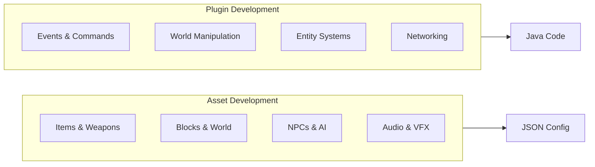

{/* [VERIFIED: 2026-01-27] */}

import { Card, CardGrid, LinkCard, Aside, Tabs, TabItem } from '@astrojs/starlight/components';

## Choose Your Path

<CardGrid>
	<Card title="Asset Development">
		Create items, blocks, NPCs, and effects with JSON.

		[Explore Assets →](/asset-development/overview/)
	</Card>
	<Card title="Plugin Development">
		Write Java plugins with events, commands, and full API access.

		[Start Coding →](/getting-started/setup/)
	</Card>
</CardGrid>



---

## Quick Start

<CardGrid>
	<LinkCard
		title="Setup Environment"
		description="Install Java 21+, configure your build tools, and prepare your IDE."
		href="/getting-started/setup/"
	/>
	<LinkCard
		title="Your First Plugin"
		description="Build a working plugin with events, commands, and logging."
		href="/getting-started/first-plugin/"
	/>
</CardGrid>

---

## See It In Action

<Tabs>
	<TabItem label="Java Plugin">
```java title="MyPlugin.java"
public class MyPlugin extends JavaPlugin {
    public MyPlugin(JavaPluginInit init) {
        super(init);
    }

    @Override
    protected void setup() {
        getEventRegistry().register(PlayerConnectEvent.class, event -> {
            getLogger().info("Welcome, " + event.getPlayerRef().getUsername() + "!");
        });
    }
}
```
	</TabItem>
	<TabItem label="JSON Asset">
```json title="Weapon_Sword_Custom.json"
{
  "Parent": "Template_Weapon_Sword",
  "Model": "Items/Weapons/Sword/Custom.blockymodel",
  "Quality": "Rare",
  "MaxDurability": 150,
  "InteractionVars": {
    "Swing_Left_Damage": {
      "DamageCalculator": { "BaseDamage": { "Physical": 18 } }
    }
  }
}
```
	</TabItem>
</Tabs>

---

## Explore the Docs

<CardGrid>
	<LinkCard
		title="Items & Weapons"
		description="Swords, tools, armor, recipes, and durability."
		href="/asset-development/items/overview/"
	/>
	<LinkCard
		title="NPCs & Behaviors"
		description="Creature models, AI, groups, and spawning."
		href="/asset-development/npcs/overview/"
	/>
	<LinkCard
		title="Events & Commands"
		description="React to player actions and create commands."
		href="/plugin-development/core-concepts/event-system/"
	/>
	<LinkCard
		title="World & Physics"
		description="Blocks, collision, hitboxes, and terrain."
		href="/plugin-development/world/overview/"
	/>
</CardGrid>

---

## Learn from Examples

Hytale includes **31 built-in plugins**. Study real implementations.

<LinkCard
	title="Built-in Plugins Reference"
	description="Explore official plugin code and learn proven patterns."
	href="/tutorials/builtin-plugins/"
/>

---

<Aside type="note">
This is an unofficial community resource curated from decompiled source analysis. Not affiliated with Hypixel Studios.
</Aside>
