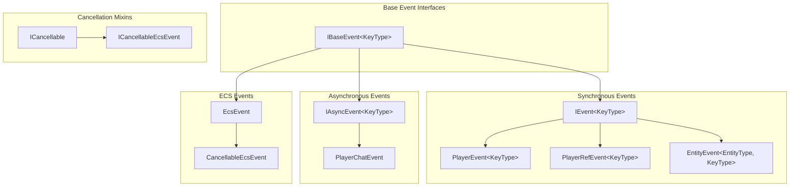

import { Aside, FileTree, Steps, Tabs, TabItem, Badge } from '@astrojs/starlight/components';

{/* [VERIFIED: 2026-01-19] */}

# Event Catalog

Complete catalog of all events in the Hytale server, organized by category.

## Package Location

- Base Interfaces: `com.hypixel.hytale.event`
- Player Events: `com.hypixel.hytale.server.core.event.events.player`
- ECS Events: `com.hypixel.hytale.server.core.event.events.ecs`
- Entity Events: `com.hypixel.hytale.server.core.event.events.entity`
- Permission Events: `com.hypixel.hytale.server.core.event.events.permissions`
- Lifecycle Events: `com.hypixel.hytale.server.core.event.events`

## Event Hierarchy



## Player Events

### Connection Lifecycle

| Event | Cancellable | Description |
|-------|-------------|-------------|
| `PlayerSetupConnectEvent` | Yes | Early connection before entity creation |
| `PlayerConnectEvent` | No | Player connected, entity available |
| `PlayerReadyEvent` | No | Player fully ready to play |
| `AddPlayerToWorldEvent` | No | Player being added to world |
| `PlayerDisconnectEvent` | No | Player disconnecting |
| `PlayerSetupDisconnectEvent` | No | Early disconnection during setup |
| `DrainPlayerFromWorldEvent` | No | Player being removed from world |

#### PlayerSetupConnectEvent

```java
public class PlayerSetupConnectEvent implements IEvent<Void>, ICancellable {
    public String getUsername();
    public UUID getUuid();
    public Auth getAuth();
    public ReferralData getReferralData();
    public InetSocketAddress getReferralSource();
    public ClientReferral getClientReferral();

    // Cancellation
    public void setCancelled(boolean cancelled);
    public boolean isCancelled();
    public void setReason(String reason);
}
```

#### PlayerConnectEvent

```java
public class PlayerConnectEvent implements IEvent<Void> {
    public Holder<EntityStore> getHolder();
    public PlayerRef getPlayerRef();
    public World getWorld();
    public void setWorld(World world);
}
```

#### PlayerDisconnectEvent

```java
public class PlayerDisconnectEvent extends PlayerRefEvent<Void> {
    public PlayerRef getPlayerRef();
    public DisconnectReason getDisconnectReason();
}
```

### Player Actions

| Event | Cancellable | Description |
|-------|-------------|-------------|
| `PlayerChatEvent` | Yes | Chat message (async) |
| `PlayerMouseButtonEvent` | Yes | Mouse button click |
| `PlayerMouseMotionEvent` | Yes | Mouse movement |
| `PlayerInteractEvent` | Yes | Player interaction (deprecated) |
| `PlayerCraftEvent` | No | Crafting (deprecated) |

#### PlayerChatEvent

```java
public class PlayerChatEvent implements IAsyncEvent<String>, ICancellable {
    public PlayerRef getSender();
    public Collection<PlayerRef> getTargets();
    public void setTargets(Collection<PlayerRef> targets);
    public String getContent();
    public void setContent(String content);
    public ChatFormatter getFormatter();
    public void setFormatter(ChatFormatter formatter);

    // Cancellation
    public void setCancelled(boolean cancelled);
    public boolean isCancelled();
}
```

#### PlayerMouseButtonEvent

```java
public class PlayerMouseButtonEvent extends PlayerEvent<Void> implements ICancellable {
    public PlayerRef getPlayerRef();
    public float getClientUseTime();
    public ItemStack getItemInHand();
    public TargetBlock getTargetBlock();
    public TargetEntity getTargetEntity();
    public Vector2f getScreenPoint();
    public MouseButton getMouseButton();
}
```

## ECS Events

### Block Events

| Event | Cancellable | Description |
|-------|-------------|-------------|
| `BreakBlockEvent` | Yes | Block being broken |
| `PlaceBlockEvent` | Yes | Block being placed |
| `DamageBlockEvent` | Yes | Block taking damage |
| `UseBlockEvent.Pre` | Yes | Before block usage |
| `UseBlockEvent.Post` | No | After block usage |

#### BreakBlockEvent

```java
public class BreakBlockEvent extends CancellableEcsEvent {
    public ItemStack getItemInHand();
    public TargetBlock getTargetBlock();
    public BlockType getBlockType();

    // From CancellableEcsEvent
    public void setCancelled(boolean cancelled);
    public boolean isCancelled();
}
```

#### PlaceBlockEvent

```java
public class PlaceBlockEvent extends CancellableEcsEvent {
    public ItemStack getItemInHand();
    public TargetBlock getTargetBlock();
    public byte getRotation();
    public void setRotation(byte rotation);
}
```

#### DamageBlockEvent

```java
public class DamageBlockEvent extends CancellableEcsEvent {
    public ItemStack getItemInHand();
    public TargetBlock getTargetBlock();
    public BlockType getBlockType();
    public float getCurrentDamage();
    public float getDamage();
    public void setDamage(float damage);
}
```

### Item Events

| Event | Cancellable | Description |
|-------|-------------|-------------|
| `DropItemEvent.Drop` | Yes | Item being dropped |
| `DropItemEvent.PlayerRequest` | Yes | Player drop request |
| `InteractivelyPickupItemEvent` | Yes | Item being picked up |
| `SwitchActiveSlotEvent` | Yes | Active slot changing |

#### DropItemEvent.Drop

```java
public static class Drop extends DropItemEvent {
    public ItemStack getItemStack();
    public float getThrowSpeed();
    public void setThrowSpeed(float speed);
}
```

#### SwitchActiveSlotEvent

```java
public class SwitchActiveSlotEvent extends CancellableEcsEvent {
    public short getPreviousSlot();
    public short getNewSlot();
    public String getInventorySectionId();
    public boolean isServerRequest();
}
```

### Crafting Events

| Event | Cancellable | Description |
|-------|-------------|-------------|
| `CraftRecipeEvent.Pre` | Yes | Before crafting |
| `CraftRecipeEvent.Post` | Yes | After crafting |

#### CraftRecipeEvent

```java
public abstract class CraftRecipeEvent extends CancellableEcsEvent {
    public CraftingRecipe getCraftedRecipe();
    public int getQuantity();

    public static class Pre extends CraftRecipeEvent { }
    public static class Post extends CraftRecipeEvent { }
}
```

### Exploration Events

| Event | Cancellable | Description |
|-------|-------------|-------------|
| `DiscoverZoneEvent.Display` | Yes | Zone discovery display |

### Gameplay Events

| Event | Cancellable | Description |
|-------|-------------|-------------|
| `ChangeGameModeEvent` | Yes | Game mode change |

```java
public class ChangeGameModeEvent extends CancellableEcsEvent {
    public GameMode getGameMode();
}
```

## Entity Events

| Event | Cancellable | Description |
|-------|-------------|-------------|
| `EntityRemoveEvent` | No | Entity being removed |
| `LivingEntityInventoryChangeEvent` | No | Inventory change |

#### EntityRemoveEvent

```java
public class EntityRemoveEvent extends EntityEvent<Entity, String> {
    public Entity getEntity();
}
```

#### LivingEntityInventoryChangeEvent

```java
public class LivingEntityInventoryChangeEvent extends EntityEvent<LivingEntity, String> {
    public LivingEntity getEntity();
    public ItemContainer getItemContainer();
    public Transaction getTransaction();
}
```

## Permission Events

### Player Permission Events

| Event | Cancellable | Description |
|-------|-------------|-------------|
| `PlayerPermissionChangeEvent.PermissionsAdded` | No | Permissions granted |
| `PlayerPermissionChangeEvent.PermissionsRemoved` | No | Permissions revoked |
| `PlayerGroupEvent.Added` | No | Added to group |
| `PlayerGroupEvent.Removed` | No | Removed from group |

```java
public static class PermissionsAdded extends PlayerPermissionChangeEvent {
    public UUID getPlayerUuid();
    public Set<String> getAddedPermissions();
}

public static class PermissionsRemoved extends PlayerPermissionChangeEvent {
    public UUID getPlayerUuid();
    public Set<String> getRemovedPermissions();
}
```

### Group Permission Events

| Event | Cancellable | Description |
|-------|-------------|-------------|
| `GroupPermissionChangeEvent.Added` | No | Permissions added to group |
| `GroupPermissionChangeEvent.Removed` | No | Permissions removed from group |

```java
public static class Added extends GroupPermissionChangeEvent {
    public String getGroupName();
    public Set<String> getAddedPermissions();
}
```

## Lifecycle Events

| Event | Cancellable | Description |
|-------|-------------|-------------|
| `BootEvent` | No | Server boot complete |
| `ShutdownEvent` | No | Server shutdown |

#### ShutdownEvent

```java
public class ShutdownEvent implements IEvent<Void> {
    public static final int DISCONNECT_PLAYERS = -48;
    public static final int UNBIND_LISTENERS = -40;
    public static final int SHUTDOWN_WORLDS = -32;
}
```

## Registering Event Listeners

### Synchronous Events

```java
@Override
protected void setup() {
    getEventRegistry().register(PlayerConnectEvent.class,
        event -> {
            PlayerRef player = event.getPlayerRef();
            getLogger().info("Player connected: " + player.getUsername());
        }
    );
}
```

### With Priority

```java
getEventRegistry().register(
    EventPriority.EARLY,
    PlayerChatEvent.class,
    event -> {
        // Process early in chain
    }
);
```

### Cancellable Events

```java
getEventRegistry().register(BreakBlockEvent.class,
    event -> {
        if (isProtectedBlock(event.getTargetBlock())) {
            event.setCancelled(true);
        }
    }
);
```

### Async Events

```java
getEventRegistry().register(PlayerChatEvent.class,
    event -> {
        // Runs on async thread
        String filtered = filterMessage(event.getContent());
        event.setContent(filtered);
    }
);
```

## Event Summary

| Category | Count | Cancellable |
|----------|-------|-------------|
| Player Connection | 7 | 1 |
| Player Actions | 5 | 4 |
| Block Events | 5 | 4 |
| Item Events | 4 | 4 |
| Crafting Events | 2 | 2 |
| Exploration Events | 1 | 1 |
| Gameplay Events | 1 | 1 |
| Entity Events | 2 | 0 |
| Permission Events | 6 | 0 |
| Lifecycle Events | 2 | 0 |
| **Total** | **35** | **17** |

## Deprecated Events

| Event | Replacement |
|-------|-------------|
| `PlayerInteractEvent` | Use ECS events |
| `PlayerCraftEvent` | Use `CraftRecipeEvent.Pre/Post` |
| `LivingEntityUseBlockEvent` | Use `UseBlockEvent` |
| `PrepareUniverseEvent` | (none) |

## Related

- [Event System](/plugin-development/core-concepts/event-system/) - Event system overview
- [Component Catalog](/plugin-development/ecs/component-catalog/) - ECS components
- [Permission System](/plugin-development/permissions/overview/) - Permission events
