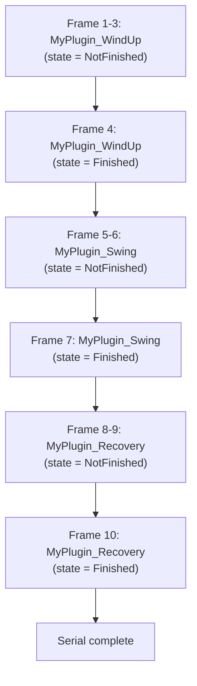
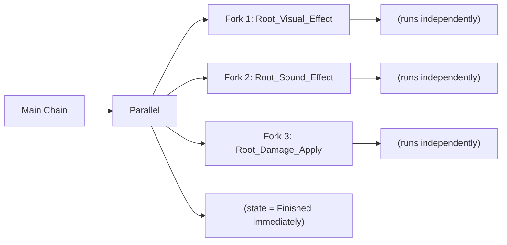
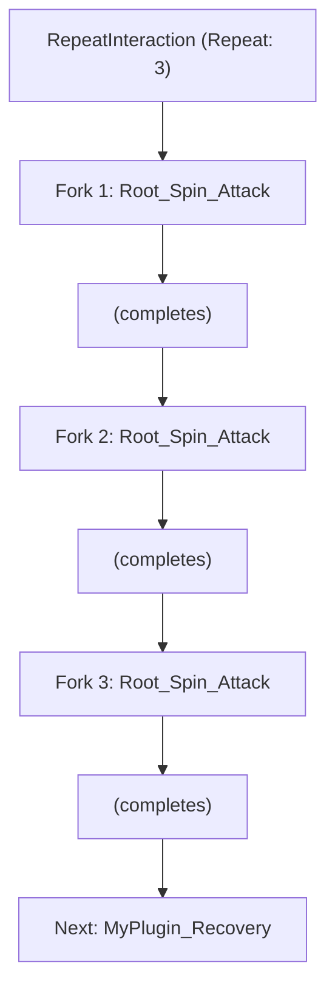

import { Aside, Tabs, TabItem, Badge } from '@astrojs/starlight/components';

{/* [VERIFIED: 2026-01-25] - From control flow interaction source analysis */}

Control flow interactions orchestrate how other interactions execute - sequentially, in parallel, in loops, or conditionally.

## Overview

| Type | Purpose | WaitForDataFrom |
|------|---------|-----------------|
| `Serial` | Run interactions in sequence | None |
| `Parallel` | Run interactions concurrently via forks | None |
| `Repeat` | Loop an interaction N times | None |
| `Chaining` | Combo systems with time windows | Client |
| `Condition` | Branch based on game state | None |

## SerialInteraction

Runs interactions one after another in order.

### JSON Configuration

```json title="Serial example"
{
  "Type": "Serial",
  "Interactions": [
    "MyPlugin_WindUp",
    "MyPlugin_Swing",
    "MyPlugin_Recovery"
  ]
}
```

### How It Works



### Source Implementation

```java
// From SerialInteraction.java
@Override
public void compile(OperationsBuilder builder) {
    for (String interaction : this.interactions) {
        Interaction.getInteractionOrUnknown(interaction).compile(builder);
    }
}

// No tick0 needed - it's all compile-time orchestration
@Override
protected void tick0(...) {
    throw new IllegalStateException("Should not be reached");
}
```

<Aside type="note">
Serial interactions are resolved at compile time - they don't actually run during gameplay. The interactions they contain are flattened into the operation list.
</Aside>

### Use Cases

- **Attack sequences**: Wind-up → Swing → Recovery
- **Ability chains**: Cast → Effect → Cooldown display
- **Multi-part effects**: Sound → Particles → Camera shake

## ParallelInteraction

Runs interactions concurrently by creating forked chains.

### JSON Configuration

```json title="Parallel example"
{
  "Type": "Parallel",
  "Interactions": [
    "Root_Visual_Effect",
    "Root_Sound_Effect",
    "Root_Damage_Apply"
  ]
}
```

<Aside type="caution">
Parallel interactions reference **RootInteractions**, not regular interactions. Each entry becomes its own forked chain.
</Aside>

### How It Works



### Source Implementation

```java
// From ParallelInteraction.java
@Override
protected void tick0(
    boolean firstRun,
    float time,
    InteractionType type,
    InteractionContext context,
    CooldownHandler cooldownHandler
) {
    // First interaction runs in current chain
    context.execute(RootInteraction.getRootInteractionOrUnknown(
        this.interactions[0]
    ));

    // Remaining interactions fork into new chains
    for (int i = 1; i < this.interactions.length; i++) {
        String interaction = this.interactions[i];
        context.fork(
            context.duplicate(),
            RootInteraction.getRootInteractionOrUnknown(interaction),
            true  // predicted
        );
    }

    // Parallel itself finishes immediately
    context.getState().state = InteractionState.Finished;
}
```

### Use Cases

- **Simultaneous effects**: Visual + Audio + Damage all at once
- **Multi-target abilities**: Hit multiple enemies in parallel
- **Background processes**: Start a long animation while triggering immediate effects

## RepeatInteraction

Loops an interaction a specified number of times.

### JSON Configuration

```json title="Repeat example"
{
  "Type": "Repeat",
  "ForkInteractions": "Root_Spin_Attack",
  "Repeat": 3,
  "Next": "MyPlugin_Recovery"
}
```

| Field | Type | Description |
|-------|------|-------------|
| `ForkInteractions` | `string` | RootInteraction to repeat |
| `Repeat` | `int` | Number of repetitions (-1 = infinite) |
| `Next` | `string` | Runs after all repetitions complete |
| `Failed` | `string` | Runs if a repetition fails |

### How It Works



### Source Implementation

```java
// From RepeatInteraction.java
private static final MetaKey<InteractionChain> FORKED_CHAIN =
    META_REGISTRY.registerMetaObject(i -> null);
private static final MetaKey<Integer> REMAINING_REPEATS =
    META_REGISTRY.registerMetaObject(i -> null);

@Override
protected void tick0(...) {
    DynamicMetaStore<Interaction> instanceStore = context.getInstanceStore();

    if (firstRun && this.repeat != -1) {
        instanceStore.putMetaObject(REMAINING_REPEATS, this.repeat);
    }

    InteractionChain chain = instanceStore.getMetaObject(FORKED_CHAIN);
    if (chain != null) {
        switch (chain.getServerState()) {
            case NotFinished:
                context.getState().state = InteractionState.NotFinished;
                return;
            case Finished:
                if (repeat != -1 && instanceStore.getMetaObject(REMAINING_REPEATS) <= 0) {
                    context.getState().state = InteractionState.Finished;
                    super.tick0(firstRun, time, type, context, cooldownHandler);
                    return;
                }
                // Continue to next repetition
                break;
            case Failed:
                context.getState().state = InteractionState.Failed;
                super.tick0(firstRun, time, type, context, cooldownHandler);
                return;
        }
    }

    // Start next fork
    chain = context.fork(
        context.duplicate(),
        RootInteraction.getRootInteractionOrUnknown(this.forkInteractions),
        true
    );
    instanceStore.putMetaObject(FORKED_CHAIN, chain);

    if (this.repeat != -1) {
        int remaining = instanceStore.getMetaObject(REMAINING_REPEATS) - 1;
        instanceStore.putMetaObject(REMAINING_REPEATS, remaining);
    }
}
```

<Aside type="caution">
Using `Repeat: -1` creates an infinite loop. Only use this with interactions that have an external exit condition.
</Aside>

### Use Cases

- **Multi-hit attacks**: Spin attack with 3 damage instances
- **Sustained effects**: Continuous damage over time
- **Channeled abilities**: Repeat until interrupted

## ChainingInteraction

Implements combo systems with time windows between inputs.

### JSON Configuration

```json title="Chaining example (combo system)"
{
  "Type": "Chaining",
  "ChainId": "Sword_Primary_Combo",
  "ChainingAllowance": 0.8,
  "Next": [
    "MyPlugin_Swing_Left",
    "MyPlugin_Swing_Right",
    "MyPlugin_Swing_Down"
  ],
  "Flags": {
    "Running": "MyPlugin_Dash_Attack"
  }
}
```

| Field | Type | Description |
|-------|------|-------------|
| `ChainId` | `string` | Unique ID for this combo chain |
| `ChainingAllowance` | `float` | Seconds before combo resets |
| `Next` | `string[]` | Sequence of interactions in combo |
| `Flags` | `object` | Alternative paths based on movement state |

### How It Works

```
Click 1 (t=0.0s):   ChainingInteraction → MyPlugin_Swing_Left
Click 2 (t=0.5s):   ChainingInteraction → MyPlugin_Swing_Right  (< 0.8s)
Click 3 (t=1.2s):   ChainingInteraction → MyPlugin_Swing_Down   (< 0.8s from last)
Click 4 (t=2.5s):   ChainingInteraction → MyPlugin_Swing_Left   (> 0.8s, reset)
```

### Source Implementation

```java
// From ChainingInteraction.java
@Override
protected void simulateTick0(...) {
    if (firstRun) {
        ChainingInteraction.Data dataComponent =
            commandBuffer.getComponent(ref, ChainingInteraction.Data.getComponentType());

        if (dataComponent != null) {
            String id = this.chainId == null ? this.id : this.chainId;
            Object2IntMap<String> map = this.chainId == null
                ? dataComponent.map
                : dataComponent.namedMap;

            int lastSequenceIndex = map.getInt(id);
            if (++lastSequenceIndex >= this.next.length) {
                lastSequenceIndex = 0;
            }

            // Reset if too much time passed
            if (this.chainingAllowance > 0.0F
                && dataComponent.getTimeSinceLastAttackInSeconds() > this.chainingAllowance) {
                lastSequenceIndex = 0;
            }

            map.put(id, lastSequenceIndex);
            state.chainingIndex = lastSequenceIndex;
            context.jump(context.getLabel(lastSequenceIndex));
            dataComponent.lastAttack = System.nanoTime();
        }
    }
}
```

### Flags for Movement-Based Combos

```json
{
  "Type": "Chaining",
  "ChainId": "Sword_Combo",
  "ChainingAllowance": 0.8,
  "Next": ["Attack_1", "Attack_2", "Attack_3"],
  "Flags": {
    "Running": "Running_Attack",
    "Jumping": "Air_Attack",
    "Crouching": "Low_Sweep"
  }
}
```

When a flag condition is met, that interaction runs instead of the normal combo sequence.

### Use Cases

- **Combat combos**: Light → Light → Heavy
- **Context-sensitive attacks**: Different moves while running/jumping
- **Stance systems**: Combo chains per stance

## ConditionInteraction

Branches based on player/entity state.

### JSON Configuration

```json title="Condition example"
{
  "Type": "Condition",
  "RequiredGameMode": "Adventure",
  "Running": true,
  "Next": "MyPlugin_Dash_Attack",
  "Failed": "MyPlugin_Normal_Attack"
}
```

| Field | Type | Description |
|-------|------|-------------|
| `RequiredGameMode` | `string` | Required game mode (Adventure, Creative, Spectator) |
| `Jumping` | `bool` | Require jumping state |
| `Swimming` | `bool` | Require swimming state |
| `Crouching` | `bool` | Require crouching state |
| `Running` | `bool` | Require running state |
| `Flying` | `bool` | Require flying state |
| `Next` | `string` | Interaction if conditions met |
| `Failed` | `string` | Interaction if conditions not met |

### Source Implementation

```java
// From ConditionInteraction.java
@Override
protected void tick0(...) {
    boolean success = true;
    CommandBuffer<EntityStore> commandBuffer = context.getCommandBuffer();
    Ref<EntityStore> ref = context.getEntity();

    // Check game mode
    Player playerComponent = commandBuffer.getComponent(ref, Player.getComponentType());
    if (this.requiredGameMode != null && playerComponent != null
        && this.requiredGameMode != playerComponent.getGameMode()) {
        success = false;
    }

    // Check movement states
    MovementStatesComponent movementStatesComponent =
        commandBuffer.getComponent(ref, MovementStatesComponent.getComponentType());
    MovementStates movementStates = movementStatesComponent.getMovementStates();

    if (this.jumping != null && this.jumping != movementStates.jumping) {
        success = false;
    }
    if (this.swimming != null && this.swimming != movementStates.swimming) {
        success = false;
    }
    if (this.crouching != null && this.crouching != movementStates.crouching) {
        success = false;
    }
    if (this.running != null && this.running != movementStates.running) {
        success = false;
    }
    if (this.flying != null && this.flying != movementStates.flying) {
        success = false;
    }

    context.getState().state = success
        ? InteractionState.Finished
        : InteractionState.Failed;
    super.tick0(firstRun, time, type, context, cooldownHandler);
}
```

### Use Cases

- **Mode-specific abilities**: Creative-only or Adventure-only
- **Movement combos**: Air attacks, dash attacks
- **State checks**: Can't attack while swimming

## Label System for Branching

Interactions can define labels for jump targets:

```java
// From ChainingInteraction.compile()
@Override
public void compile(OperationsBuilder builder) {
    Label[] labels = new Label[this.next.length];

    // Create labels for each branch
    for (int i = 0; i < labels.length; i++) {
        labels[i] = builder.createUnresolvedLabel();
    }

    builder.addOperation(this, labels);
    Label end = builder.createUnresolvedLabel();

    // Compile each branch
    for (int i = 0; i < this.next.length; i++) {
        builder.resolveLabel(labels[i]);
        Interaction.getInteractionOrUnknown(this.next[i]).compile(builder);
        builder.jump(end);
    }

    builder.resolveLabel(end);
}
```

### Jumping to Labels

```java
// Jump to a specific label
context.jump(context.getLabel(labelIndex));
```

## compile() and walk() Methods

### compile() - Build Operation List

Called once at load time to flatten the interaction tree into an operation list:

```java
@Override
public void compile(OperationsBuilder builder) {
    // Add this interaction as an operation
    builder.addOperation(this);

    // Compile child interactions
    for (String child : this.children) {
        Interaction.getInteractionOrUnknown(child).compile(builder);
    }
}
```

### walk() - Collect Data from Tree

Called to gather information from the interaction tree:

```java
@Override
public boolean walk(Collector collector, InteractionContext context) {
    for (int i = 0; i < this.interactions.length; i++) {
        if (InteractionManager.walkInteraction(
            collector,
            context,
            SerialTag.of(i),
            this.interactions[i]
        )) {
            return true; // Collector found what it needed
        }
    }
    return false;
}
```

Use cases for `walk()`:
- Finding all damage values in a chain
- Collecting animation IDs
- Analyzing interaction structure

## Complex Example

Here's a complete combo system with conditions:

```json title="Complete combo with conditions"
{
  "Type": "Chaining",
  "ChainId": "Advanced_Combo",
  "ChainingAllowance": 1.0,
  "Next": [
    {
      "Type": "Condition",
      "Running": false,
      "Next": "Attack_Standing_1",
      "Failed": "Attack_Running_1"
    },
    {
      "Type": "Serial",
      "Interactions": [
        "Attack_Standing_2",
        "Attack_Followup"
      ]
    },
    {
      "Type": "Parallel",
      "Interactions": [
        "Root_Attack_Finisher",
        "Root_Finisher_Effects"
      ]
    }
  ],
  "Flags": {
    "Jumping": {
      "Type": "Serial",
      "Interactions": [
        "Air_Attack",
        "Air_Recovery"
      ]
    }
  }
}
```

This creates a combo where:
1. First hit checks if running (different attack)
2. Second hit is a two-part sequence
3. Third hit triggers finisher with parallel effects
4. Jumping at any point triggers air combo

## Related

- [Asset-Based Interactions](/plugin-development/interactions/asset-interactions/) - JSON interaction guide
- [Charging Mechanics](/plugin-development/interactions/charging-interactions/) - Hold-to-charge patterns
- [Interaction Lifecycle](/plugin-development/interactions/interaction-lifecycle/) - Execution model
- [Java Operations](/plugin-development/interactions/java-operations/) - Custom implementations
