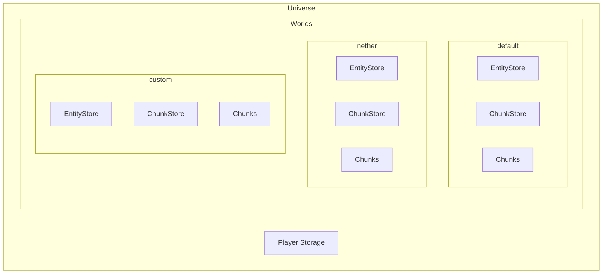
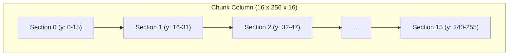

{/* [VERIFIED: 2026-01-19] */}

import { Aside, FileTree, Steps, Tabs, TabItem, Badge } from '@astrojs/starlight/components';

# World System Overview

The World System manages the game universe, individual worlds, chunks, blocks, and lighting. It provides the spatial foundation for all gameplay.

## Package Location

- Universe: `com.hypixel.hytale.server.core.universe.Universe`
- World: `com.hypixel.hytale.server.core.universe.world.World`
- WorldConfig: `com.hypixel.hytale.server.core.universe.world.WorldConfig`
- EntityStore: `com.hypixel.hytale.server.core.universe.world.storage.EntityStore`
- ChunkStore: `com.hypixel.hytale.server.core.universe.world.storage.ChunkStore`

## Architecture



## Universe

The `Universe` class is the top-level container for all worlds and player data.

### Accessing the Universe

```java
import com.hypixel.hytale.server.core.universe.Universe;

Universe universe = Universe.get();
```

### Key Methods

| Method | Return Type | Description |
|--------|-------------|-------------|
| `get()` | `Universe` | Get the singleton universe instance |
| `getWorlds()` | `Map<String, World>` | Get all loaded worlds |
| `getWorld(name)` | `World` | Get world by name |
| `getWorld(uuid)` | `World` | Get world by UUID |
| `getDefaultWorld()` | `World` | Get the default world |
| `getPlayers()` | `List<PlayerRef>` | Get all online players |
| `getPlayer(uuid)` | `PlayerRef` | Get player by UUID |
| `getPlayerStorage()` | `PlayerStorage` | Access player data storage |

### World Management

```java
// Get all worlds
Map<String, World> worlds = universe.getWorlds();

// Get specific world
World netherWorld = universe.getWorld("nether");

// Get default world
World defaultWorld = universe.getDefaultWorld();

// Check if world exists
if (universe.getWorlds().containsKey("custom")) {
    // World exists
}
```

### Player Access

```java
// Get all online players across all worlds
for (PlayerRef player : universe.getPlayers()) {
    // Process each player
}

// Find player by name
PlayerRef player = universe.getPlayerByUsername("username", NameMatching.DEFAULT);
```

## World

Each `World` represents a separate game world with its own chunks, entities, and rules.

### Accessing a World

```java
// From Universe
World world = Universe.get().getWorld("default");

// From a player command context
World world = player.getWorld();

// From an entity
World world = entity.getWorld();
```

### Key Properties

| Property | Type | Description |
|----------|------|-------------|
| `name` | `String` | World's unique name |
| `savePath` | `Path` | Filesystem path for world data |
| `worldConfig` | `WorldConfig` | World configuration |
| `entityStore` | `EntityStore` | Entity ECS store |
| `chunkStore` | `ChunkStore` | Chunk ECS store |
| `tick` | `long` | Current world tick |
| `random` | `Random` | World's random generator |

### World Methods

```java
// Get world name
String name = world.getName();

// Get stores
EntityStore entityStore = world.getEntityStore();
ChunkStore chunkStore = world.getChunkStore();

// Get current tick
long tick = world.getTick();

// Check world state
boolean isTicking = world.isTicking();
boolean isPaused = world.isPaused();

// Get world seed
long seed = world.getWorldConfig().getSeed();
```

### Player Management

```java
// Get players in this world
Collection<PlayerRef> players = world.getPlayerRefs();

// Check player count
int playerCount = world.getPlayerRefs().size();

// Send message to all players
world.sendMessage(Message.raw("Hello everyone!"));
```

### Block Operations

```java
// Get block at position
int blockId = world.getBlock(x, y, z);
BlockType blockType = world.getBlockType(x, y, z);

// Set block
world.setBlock(x, y, z, blockType);

// With settings
SetBlockSettings settings = new SetBlockSettings()
    .withNotifyNeighbors(true)
    .withUpdateLighting(true);
world.setBlock(x, y, z, blockType, settings);

// Check if position is loaded
if (world.isChunkLoaded(chunkX, chunkZ)) {
    // Safe to access blocks
}
```

### Chunk Operations

```java
// Get chunk at position
WorldChunk chunk = world.getChunk(chunkX, chunkZ);

// Get chunk containing block position
WorldChunk chunk = world.getChunkAt(blockX, blockZ);

// Check chunk state
boolean loaded = world.isChunkLoaded(chunkX, chunkZ);

// Load chunk async
CompletableFuture<WorldChunk> future = world.loadChunkAsync(chunkX, chunkZ);
```

## World Configuration

`WorldConfig` defines how a world behaves.

### Key Configuration Options

| Option | Type | Description |
|--------|------|-------------|
| `seed` | `long` | World generation seed |
| `gameTime` | `long` | Starting game time |
| `ticking` | `boolean` | Whether world ticks |
| `worldGenProvider` | `IWorldGenProvider` | World generator |
| `chunkStorageProvider` | `IChunkStorageProvider` | Chunk storage type |
| `spawnProvider` | `ISpawnProvider` | Spawn location logic |
| `gameplayConfig` | `GameplayConfig` | Combat, death, gameplay rules |

### World Generator Providers

| Provider | Description |
|----------|-------------|
| `FlatWorldGenProvider` | Flat world generation |
| `VoidWorldGenProvider` | Empty void world |
| `DummyWorldGenProvider` | No generation |

### Chunk Storage Providers

| Provider | Description |
|----------|-------------|
| `DefaultChunkStorageProvider` | Default file-based storage |
| `EmptyChunkStorageProvider` | No persistence |
| `IndexedStorageChunkStorageProvider` | Optimized indexed storage |

### Spawn Providers

| Provider | Description |
|----------|-------------|
| `GlobalSpawnProvider` | Single spawn point for all |
| `IndividualSpawnProvider` | Per-player spawn points |
| `FitToHeightMapSpawnProvider` | Spawn on terrain surface |

## Entity Store & Chunk Store

Each world has two ECS stores:

### EntityStore

For world entities (players, mobs, items):

```java
EntityStore entityStore = world.getEntityStore();
Store<EntityStore> store = entityStore.getStore();

// Spawn entity
Holder<EntityStore> holder = store.getRegistry().newHolder();
holder.addComponent(positionType, new PositionComponent(x, y, z));
Ref<EntityStore> ref = store.spawn(holder);

// Access entity components
PositionComponent pos = store.getComponent(ref, positionType);
```

### ChunkStore

For chunk-level data:

```java
ChunkStore chunkStore = world.getChunkStore();
Store<ChunkStore> store = chunkStore.getStore();

// Access chunk components
ChunkComponent data = store.getComponent(chunkRef, chunkDataType);
```

## World Events

### World Lifecycle Events

```java
// World starting
getEventRegistry().register(StartWorldEvent.class, event -> {
    World world = event.getWorld();
    // Initialize world-specific resources
});

// World added to universe
getEventRegistry().register(AddWorldEvent.class, event -> {
    World world = event.getWorld();
});

// World removed from universe
getEventRegistry().register(RemoveWorldEvent.class, event -> {
    World world = event.getWorld();
});

// All worlds loaded
getEventRegistry().register(AllWorldsLoadedEvent.class, event -> {
    // Server fully initialized
});
```

### Player World Events

```java
// Player added to world
getEventRegistry().register(AddPlayerToWorldEvent.class, event -> {
    World world = event.getWorld();
    PlayerRef player = event.getPlayerRef();
});

// Player removed from world
getEventRegistry().register(DrainPlayerFromWorldEvent.class, event -> {
    World world = event.getWorld();
    PlayerRef player = event.getPlayerRef();
});
```

## Chunk System

### Chunk Structure

Chunks are 16x256x16 block columns divided into 16x16x16 sections:



### Chunk Coordinates

```java
// Convert block coords to chunk coords
int chunkX = Math.floorDiv(blockX, 16);
int chunkZ = Math.floorDiv(blockZ, 16);

// Or use utility
int chunkX = ChunkUtil.blockToChunk(blockX);
int chunkZ = ChunkUtil.blockToChunk(blockZ);

// Local position within chunk (0-15)
int localX = blockX & 15;
int localZ = blockZ & 15;
```

### Working with Chunks

```java
// Get chunk
WorldChunk chunk = world.getChunk(chunkX, chunkZ);

// Check if chunk is generated
if (chunk != null && chunk.isGenerated()) {
    // Safe to read blocks
}

// Load chunk async
world.loadChunkAsync(chunkX, chunkZ).thenAccept(chunk -> {
    // Chunk is now loaded
});
```

## Block Operations

### Block Types

```java
// Get block type by ID
BlockType blockType = BlockType.getAssetMap().get("Rock_Stone");

// Get block type at position
BlockType type = world.getBlockType(x, y, z);

// Get block ID
int blockId = world.getBlock(x, y, z);
```

### Setting Blocks

```java
// Simple set
world.setBlock(x, y, z, blockType);

// With custom settings
SetBlockSettings settings = new SetBlockSettings();
settings.setNotifyNeighbors(true);
settings.setUpdateLighting(true);
settings.setTriggerBlockUpdate(true);

world.setBlock(x, y, z, blockType, settings);
```

### Block States

Block states provide additional block data:

```java
// Get block state
BlockState state = world.getBlockState(x, y, z);

// Check state properties
if (state.hasProperty("powered")) {
    boolean powered = state.getBoolean("powered");
}
```

## Lighting System

The lighting system handles both sky and block light:

```java
// Get light level at position
int skyLight = world.getSkyLight(x, y, z);
int blockLight = world.getBlockLight(x, y, z);
int combinedLight = world.getLight(x, y, z);

// Lighting is updated automatically when blocks change
```

## Running Tasks on World Thread

Worlds run on their own thread. Schedule tasks appropriately:

```java
// Execute on world thread
world.execute(() -> {
    // This runs on the world's thread
    world.setBlock(x, y, z, blockType);
});

// Or use CompletableFuture
CompletableFuture.runAsync(() -> {
    // World thread operations
}, world);
```

## Best Practices

1. **Check chunk loading**: Always verify chunks are loaded before block access
2. **Use async loading**: Load chunks asynchronously to avoid blocking
3. **Run on correct thread**: World operations must run on the world's thread
4. **Cache block types**: Store BlockType references, don't look up repeatedly
5. **Batch operations**: Group multiple block changes when possible

## Related

- [ECS Overview](/plugin-development/core-concepts/ecs-overview/) - Entity Component System
- [Entity System](/plugin-development/entities/overview/) - Entity management
- [Block Types](/plugin-development/blocks/overview/) - Block type assets
