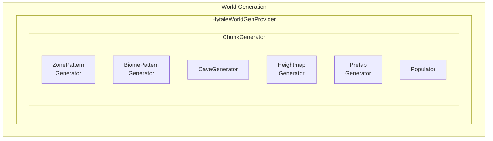

import { Aside, FileTree, Steps, Tabs, TabItem, Badge } from '@astrojs/starlight/components';

{/* [VERIFIED: 2026-01-24] - Updated with Update 2 prop types */}

# World Generation Overview

The World Generation system creates terrain, structures, and biomes for Hytale worlds. It uses a procedural generation pipeline with zones, biomes, caves, and prefabs.

## Package Location

- Providers: `com.hypixel.hytale.server.core.universe.world.worldgen.provider`
- Hytale generator: `com.hypixel.hytale.server.worldgen`
- Generated chunks: `com.hypixel.hytale.server.core.universe.world.worldgen`

## Architecture



## World Gen Providers

### IWorldGenProvider Interface

```java
public interface IWorldGenProvider {
    IWorldGen getGenerator() throws WorldGenLoadException;
}
```

### HytaleWorldGenProvider

The default world generation provider for Hytale:

```java
public class HytaleWorldGenProvider implements IWorldGenProvider {
    public static final String ID = "Hytale";

    // Configuration
    String name = "Default";  // Generator name
    String path;              // Custom path (optional)
}
```

### World Config Usage

```json
{
  "WorldGenProvider": {
    "Type": "Hytale",
    "Name": "MyWorldGen",
    "Path": "path/to/worldgen/config"
  }
}
```

### Built-in Providers

| Provider | Description |
|----------|-------------|
| `HytaleWorldGenProvider` | Full procedural terrain (in `server.worldgen` package) |
| `FlatWorldGenProvider` | Flat terrain |
| `VoidWorldGenProvider` | Empty void world |
| `DummyWorldGenProvider` | No generation |
| `HandleProvider` | Custom handle-based generator (in `builtin.hytalegenerator`) |

## ChunkGenerator

The core class that generates chunks:

```java
public class ChunkGenerator implements IBenchmarkableWorldGen, IWorldMapProvider {
    // Pool size based on CPU cores
    public static final int POOL_SIZE = Math.max(2,
        (int) Math.ceil(Runtime.getRuntime().availableProcessors() * 0.75));

    // Get zone data at coordinates
    public ZoneBiomeResult getZoneBiomeResultAt(int seed, int x, int z);

    // Get height at coordinates
    public int getHeight(int seed, int x, int z);

    // Get cave data
    public Cave getCave(CaveType caveType, int seed, int x, int z);

    // Get spawn points
    public Transform[] getSpawnPoints(int seed);
}
```

### Generation Pipeline

1. **Zone Generation**: Determine zone at position
2. **Biome Generation**: Determine biome within zone
3. **Heightmap**: Generate terrain height
4. **Block Placement**: Place blocks based on layers
5. **Cave Carving**: Carve caves and caverns
6. **Prefab Placement**: Place structures
7. **Population**: Add details (ores, plants, etc.)

## Zones

Zones are large-scale regions of the world with distinct generation rules.

### Zone Record

```java
public record Zone(
    int id,
    String name,
    ZoneDiscoveryConfig discoveryConfig,
    CaveGenerator caveGenerator,
    BiomePatternGenerator biomePatternGenerator,
    UniquePrefabContainer uniquePrefabContainer
) {}
```

### Zone Configuration

```json
{
  "Id": 1,
  "Name": "Plains",
  "DiscoveryConfig": {
    "DiscoverKey": "zone_plains",
    "DiscoverRadius": 100
  },
  "CaveGenerator": "DefaultCaves",
  "BiomePattern": "plains_biomes.png"
}
```

### Zone Pattern Provider

Generates zone layout based on patterns:

```java
public class ZonePatternProvider {
    // Zone pattern generation
}

public class ZonePatternGenerator {
    // Generate zone at coordinates
}
```

## Biomes

Biomes define terrain characteristics within zones.

### Biome Class

```java
public abstract class Biome {
    int id;
    String name;
    BiomeInterpolation interpolation;
    IHeightThresholdInterpreter heightmapInterpreter;

    // Containers
    CoverContainer coverContainer;       // Surface cover (grass, etc.)
    LayerContainer layerContainer;       // Block layers
    PrefabContainer prefabContainer;     // Structures
    TintContainer tintContainer;         // Color tinting
    EnvironmentContainer environmentContainer;  // Environment settings
    WaterContainer waterContainer;       // Water features
    FadeContainer fadeContainer;         // Biome transitions

    // Noise
    NoiseProperty heightmapNoise;

    // Visual
    int mapColor;
}
```

### Biome Containers

| Container | Description |
|-----------|-------------|
| `CoverContainer` | Surface blocks (grass, snow) |
| `LayerContainer` | Block layer definitions |
| `PrefabContainer` | Structure placement |
| `TintContainer` | Block tinting rules |
| `EnvironmentContainer` | Environment settings |
| `WaterContainer` | Water/fluid settings |
| `FadeContainer` | Transition rules |

### Layer Container

Defines block layers from surface to bedrock:

```json
{
  "Layers": [
    {
      "Block": "Grass",
      "Depth": 1
    },
    {
      "Block": "Dirt",
      "Depth": 3
    },
    {
      "Block": "Stone",
      "Depth": -1
    }
  ]
}
```

## Cave Generation

### CaveGenerator

```java
public class CaveGenerator {
    // Generate caves for a region
}

public enum CaveType {
    // Cave type definitions
}

public class Cave {
    // Cave data
}
```

### Cave Configuration

```json
{
  "CaveType": "Standard",
  "Frequency": 0.5,
  "MinHeight": 10,
  "MaxHeight": 64,
  "Radius": {
    "Min": 2,
    "Max": 5
  }
}
```

## Prefabs

Prefabs are pre-built structures placed during generation.

### PrefabContainer

```java
public class PrefabContainer {
    // Prefab placement rules
}

public class PrefabLoadingCache {
    // Cache for loaded prefabs
}
```

### Prefab Configuration

```json
{
  "Prefabs": [
    {
      "Id": "Village_House",
      "Chance": 0.1,
      "MinDistance": 100,
      "GroundLevel": "Surface"
    }
  ]
}
```

### Unique Prefabs

Special one-per-world prefabs:

```java
public class UniquePrefabContainer {
    // Unique prefab management

    public static class UniquePrefabEntry {
        boolean isSpawnLocation();
        Vector3i getPosition();
        Vector3d getSpawnOffset();
        Rotation getRotation();
    }
}
```

## Props

<Aside type="note" title="New in Update 2">
`WeightedProp` and `OffsetProp` were added in Update 2 for more flexible world generation.
</Aside>

Props are decorative elements placed during world generation. Server v2 introduces new prop types for enhanced placement control.

### WeightedProp

Selects a child prop randomly based on weight probability:

```java
public class WeightedProp implements Prop {
    // Weight-based random selection from child props
    private final List<WeightedEntry> entries;

    public record WeightedEntry(Prop prop, float weight) {}
}
```

**Configuration**:

```json title="Weighted prop example"
{
  "Type": "Weighted",
  "Entries": [
    { "Prop": "Tree_Oak_Large", "Weight": 0.1 },
    { "Prop": "Tree_Oak_Medium", "Weight": 0.3 },
    { "Prop": "Tree_Oak_Small", "Weight": 0.6 }
  ]
}
```

| Field | Type | Description |
|-------|------|-------------|
| `Entries` | `array` | List of weighted prop entries |
| `Entries[].Prop` | `string` | Prop ID to place |
| `Entries[].Weight` | `float` | Relative weight (higher = more likely) |

**Use Cases**:
- Varied tree sizes (mostly small, occasionally large)
- Rock formations with random sizes
- Flower variety in meadows

### OffsetProp

Applies a position offset to a child prop:

```java
public class OffsetProp implements Prop {
    // Offset applied to child prop position
    private final Prop childProp;
    private final Vector3d offset;
}
```

**Configuration**:

```json title="Offset prop example"
{
  "Type": "Offset",
  "Prop": "Mushroom_Cluster",
  "Offset": { "X": 0, "Y": -0.5, "Z": 0 }
}
```

| Field | Type | Description |
|-------|------|-------------|
| `Prop` | `string` | Child prop ID |
| `Offset` | `Vector3d` | Position offset to apply |

**Use Cases**:
- Partially buried objects
- Floating elements (vines, hanging plants)
- Stacked prop combinations

### SimpleHorizontalPositionProvider

<Aside type="caution">
`VerticalEliminatorPositionProvider` was renamed to `SimpleHorizontalPositionProvider` in Update 2.
</Aside>

Provides horizontal positions for prop placement:

```java
public class SimpleHorizontalPositionProvider implements PositionProvider {
    // Generates horizontal positions within a region
}
```

**Configuration**:

```json title="Position provider example"
{
  "Type": "SimpleHorizontal",
  "Density": 0.1,
  "MinSpacing": 2.0,
  "MaxSpacing": 8.0
}
```

## Populators

Populators add details after basic terrain is generated.

### Built-in Populators

| Populator | Description |
|-----------|-------------|
| `BlockPopulator` | Place additional blocks |
| `CavePopulator` | Carve caves |
| `WaterPopulator` | Add water features |
| `PrefabPopulator` | Place structures |

### Populator Interface

```java
public interface IPopulator {
    void populate(GeneratedChunk chunk, Random random);
}
```

## Generated Chunk

The output of chunk generation:

```java
public class GeneratedChunk {
    // Block data
    GeneratedBlockChunk blockChunk;

    // Block states
    GeneratedBlockStateChunk blockStateChunk;

    // Entities
    GeneratedEntityChunk entityChunk;
}
```

## Noise Functions

World generation uses noise for natural variation.

### NoiseProperty

```java
public class NoiseProperty {
    // Noise configuration
}
```

### Height Threshold Interpreter

```java
public interface IHeightThresholdInterpreter {
    // Interpret height thresholds for biome-specific terrain
}
```

## Procedural Library

The procedural library provides tools for generation:

### Conditions

```java
// Height-based conditions
IHeightThresholdInterpreter

// Block-based conditions
HashSetBlockFluidCondition
FilteredBlockFluidCondition
BlockMaskCondition
```

### Property Suppliers

```java
ICoordinateDoubleSupplier
ConstantCoordinateDoubleSupplier
RandomCoordinateDoubleSupplier
```

## World Bounds

```java
public interface IWorldBounds {
    int getMinX();
    int getMaxX();
    int getMinZ();
    int getMaxZ();
}

public interface IChunkBounds {
    int getMinChunkX();
    int getMaxChunkX();
    int getMinChunkZ();
    int getMaxChunkZ();
}
```

## Caching

World generation uses extensive caching:

```java
public class ChunkGeneratorCache {
    // Cache zone/biome results
    // Cache heights
    // Cache interpolated values
}

public class CaveGeneratorCache {
    // Cache cave data
}

public class PrefabLoadingCache {
    // Cache loaded prefabs
}
```

## Configuration Files

### World.json

Main world generation configuration:

```json
{
  "Zones": "zones/",
  "DefaultZone": "Plains",
  "SeaLevel": 64,
  "WorldHeight": 256,
  "Caves": {
    "Enabled": true,
    "Types": ["Standard", "Cavern"]
  }
}
```

### Zone Configuration

Each zone has its own configuration:

<FileTree>
- worldgen/
  - World.json
  - zones/
    - Plains/
      - zone.json
      - biomes/
        - Grassland.json
        - Forest.json
    - Mountains/
      - zone.json
      - biomes/
        - Alpine.json
  - prefabs/
    - village/
    - dungeons/
</FileTree>

## Custom World Generation

### Implementing IWorldGenProvider

```java
public class MyWorldGenProvider implements IWorldGenProvider {
    public static final BuilderCodec<MyWorldGenProvider> CODEC =
        BuilderCodec.builder(MyWorldGenProvider.class, MyWorldGenProvider::new)
            // Add configuration fields
            .build();

    @Override
    public IWorldGen getGenerator() throws WorldGenLoadException {
        return new MyChunkGenerator();
    }
}
```

### Registering Provider

```java
@Override
protected void setup() {
    // Register world gen provider type
    getCodecRegistry().register(
        IWorldGenProvider.CODEC,
        "MyPlugin_WorldGen",
        MyWorldGenProvider.CODEC
    );
}
```

## Timings and Metrics

```java
public class WorldGenTimingsCollector {
    // Collect generation timings
}

// ChunkGenerator implements MetricProvider
public interface MetricProvider {
    MetricResults getMetrics();
}
```

## Best Practices

1. **Use caching**: Leverage built-in caches for performance
2. **Async generation**: Use thread pool for heavy operations
3. **Seed consistency**: Ensure deterministic generation from seed
4. **Validate output**: Use `ValidatableWorldGen` interface
5. **Profile performance**: Use benchmarking tools
6. **Modular design**: Separate zones, biomes, and populators

## Related

- [World System](/plugin-development/world/overview/) - World management
- [Block System](/plugin-development/blocks/overview/) - Block types
- [Asset System](/asset-development/overview/) - Prefab assets
